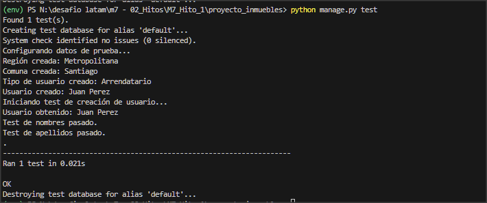

# Proyecto de Gestión de Arriendos

Este proyecto es una aplicación web desarrollada en Django para gestionar el arriendo de inmuebles. Los usuarios pueden registrarse, gestionar propiedades, y realizar solicitudes de arriendo.

## Funcionalidades

- **Usuarios**: Registro y gestión de usuarios.
- **Propiedades**: Registro, actualización y eliminación de inmuebles.
- **Solicitudes de Arriendo**: Creación y gestión de solicitudes de arriendo.
- **Pagos**: Registro de pagos asociados a las solicitudes de arriendo.

## Estructura de la Base de Datos

El proyecto utiliza los siguientes modelos:

- `Usuario`: Gestiona los datos de los usuarios registrados.
- `TipoUsuario`: Define los tipos de usuarios (Arrendatario, Propietario, etc.).
- `Region`: Registra las regiones.
- `Comuna`: Registra las comunas asociadas a una región.
- `Inmueble`: Gestiona la información de los inmuebles disponibles.
- `SolicitudArriendo`: Registra las solicitudes de arriendo realizadas por los usuarios.
- `Pago`: Registra los pagos asociados a las solicitudes de arriendo.

## Requisitos

- Python 3.x
- Django 3.x
- SQLite (base de datos predeterminada)
